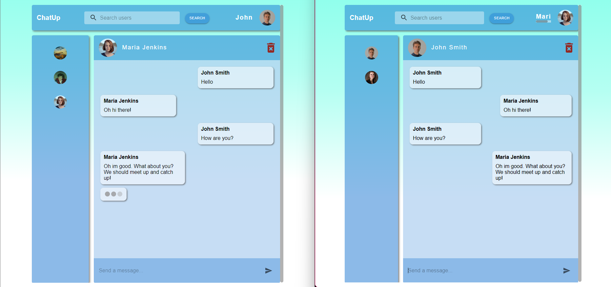
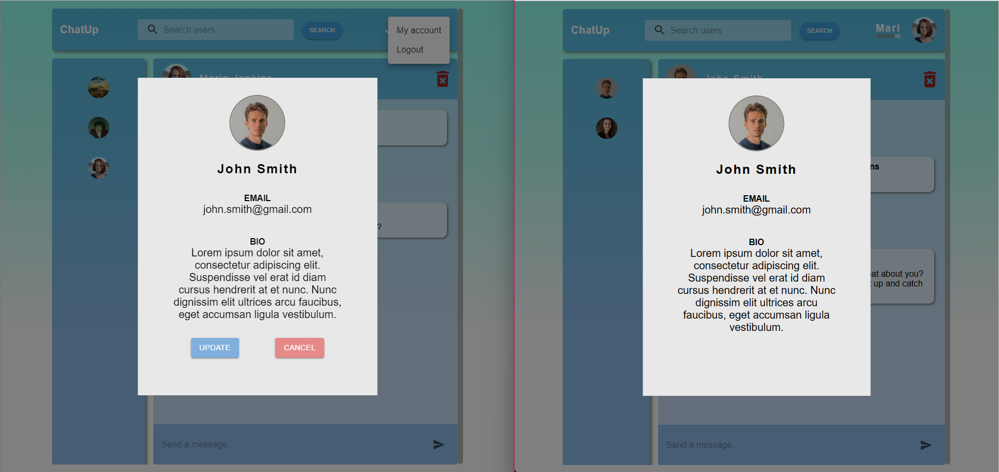
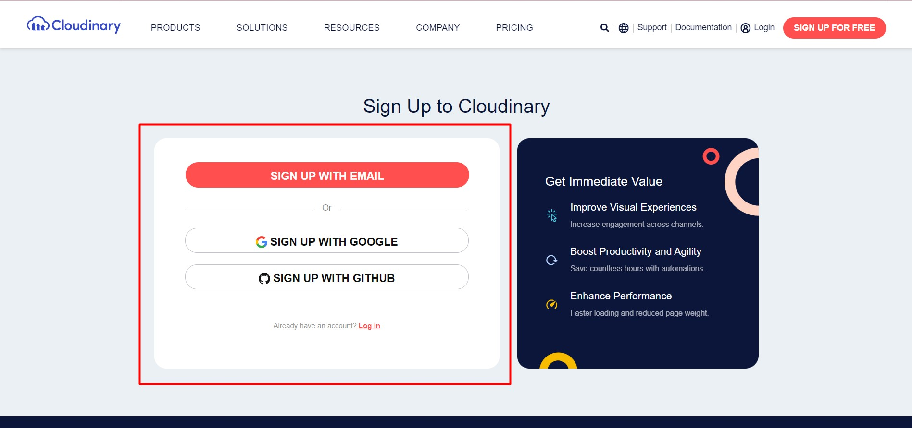
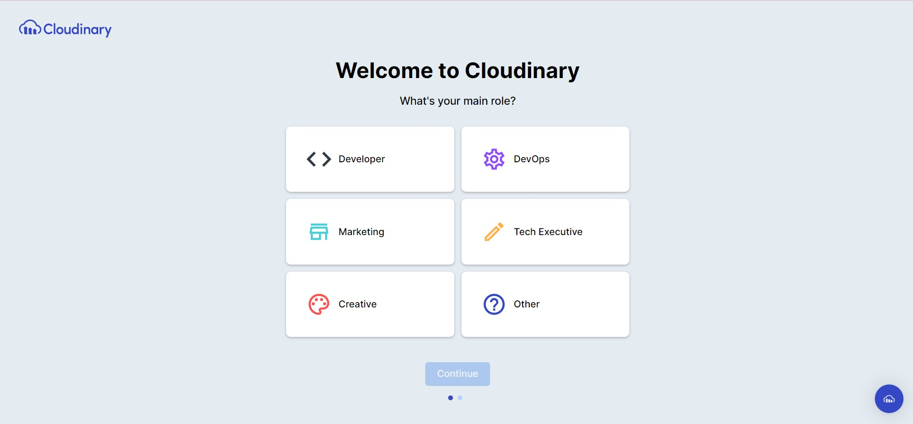
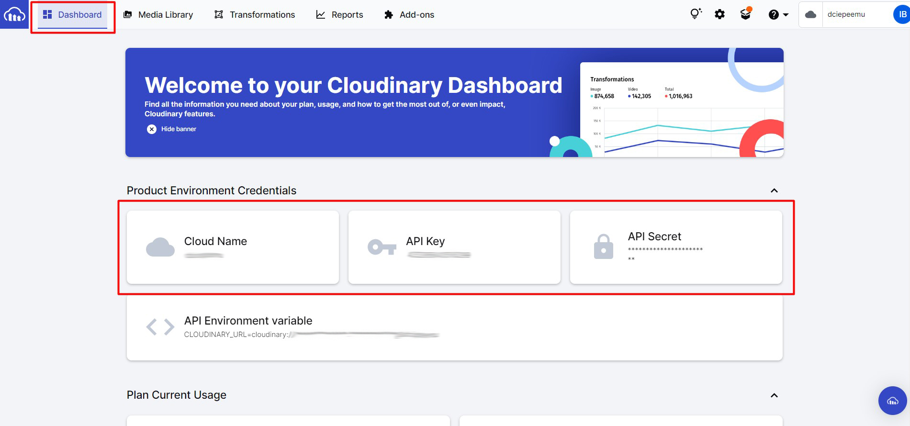

# ChatUp
A messenger application, where you can connect with your friends and chat over the internet. Created with socket.io. 

## Features
While using this app users can:
* Create an account
* Sign in to their account
* Update their account information
* Search for users
* Add a friend to the chat list
* Remove a friend from the chat list
* See friends account information
* Send a real-time message to a friend
* Receive real-time messages from friends
* See when a friend is typing

## Screenshots



## Technologies
Project is created with:
* Node.js
* Express
* MongoDB
* Bcrypt
* Jsonwebtoken
* Cloudinary
* Multer
* Socket.io
* React
* React-redux
* Redux-persist
* Redux-thunk
* Socket.io-client
* Axios
* Material-ui

## Setup
### Create Cloudinary account:
1. First, create a Cloudinary account:

2. Choose preferred sign up method

3. Go through initial questions

4. In your account, in the header select "Dashboard". Below you will see Cloudinary credentials, which are needed for setup later.


### Clone project to your machine:
5. Clone repository:
```
git clone https://github.com/ibabaityte/ChatUp.git
```
### Install and setup server:
6. Get in the api folder:
```
cd api
```
7. Install dependencies:
```
npm i
```
8. Setup some environment variables, which are found at "Dashboard" section in your Cloudinary account:
```
echo CLOUDINARY_CLOUD_NAME=*your Cloudinary Cloud Name* >> .env
echo CLOUDINARY_API_KEY=*your Cloudinary API Key* >> .env
echo CLOUDINARY_API_SECRET=*your Cloudinary API Secret* >> .env
```
9. Start server:
```
npm start
```

### Install client
10. Get in the client folder:
```
cd client
```
11. Install dependencies:
```
npm i
```
12. Start server:
```
npm start
```
